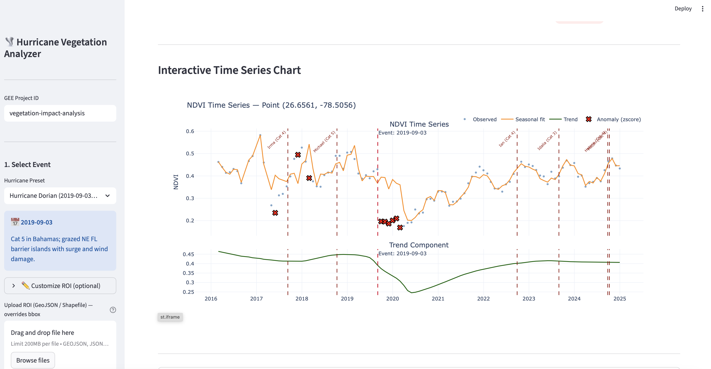

# Hurricane Vegetation Impacts Analyzer

This repository contains tools for analyzing hurricane-related vegetation impacts using Google Earth Engine and satellite/lidar datasets.

## Repository layout

- `hurricane_vegetation_analysis/` — main Python application code, CLI, Streamlit app, tests, and detailed documentation
- `shapes/` — example ROI shapefiles used for analyses

## Start here

For installation, configuration, and full usage instructions, see:

- [Detailed project README](hurricane_vegetation_analysis/README.md)

## Streamlit interface

## Development status and disclaimer

This software is under active development and has not been exhaustively tested across all workflows or datasets.

Use it with caution and at your own risk. Always validate outputs independently before using results for scientific, operational, policy, or safety-critical decisions.

## License

The project source code is licensed under the [MIT License](LICENSE).

Use of Google Earth Engine and remote datasets (e.g., Sentinel, Landsat, PALSAR-2, GEDI) is governed by their respective platform and data-provider terms.
